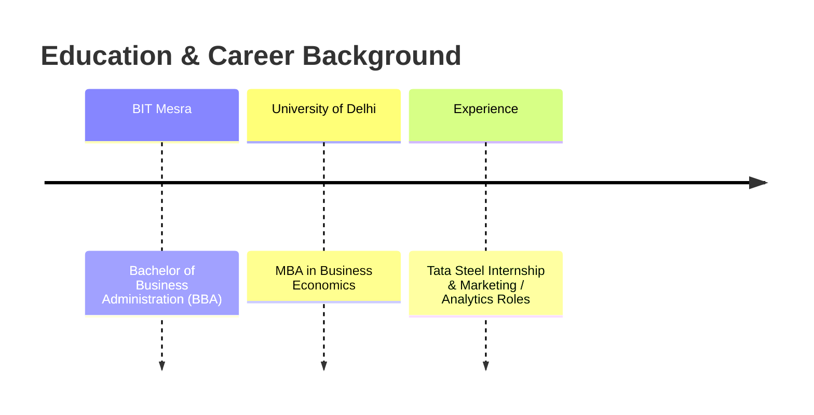

# Hey! 👋 I’m Mangal from Jamshedpur.

> **Product Management | Product Building | Automation & AI Workflows**

---

### 💡 About Me

> I enjoy taking a problem or a rough idea, understanding it from a user’s perspective, and then building a simple working version to see what works and what doesn’t.
> 
> Most of the things I build are learning projects — sometimes they work, sometimes they don’t. The fun part for me is figuring out why, testing different approaches, and improving them along the way.

---

### 🛠️ What I’m Learning & Using

| Domain | Technologies & Skills |
| :--- | :--- |
| **Product & Prototyping** | Problem exploration • User flows • Simple MVPs • Testing & iteration |
| **Automation & AI** |    n8n Workflows • Gemini & OpenAI APIs • Automation Scripts |
| **Development** |      Python • REST APIs • Next.js • TailwindCSS • Supabase • Firebase |
| **Tools & Analytics** |   Git • GitHub • Basic Analytics • Research & Documentation |

---

### 🚀 Things I’ve Built

| Project | Overview & Core Focus | Category |
| :--- | :--- | :--- |
| **🏠 UGhar** | A hyperlocal home-services platform built around local service requests, booking, and technician workflows. | Product MVP |
| **🎌 Kanjo** | An anime discovery platform exploring mood and feeling-based content discovery. | Product MVP |
| **📊 Creatorlytics** | A creator-focused tool for managing sponsorships, brand deals, and revenue tracking. | Creator SaaS |
| **🎬 CreatiGen** | An experiment around helping creators turn long-form source videos into short-form content. | AI Experiment |
| **🧠 Perspective.ai** | A simple experiment around turning complex choices into structured decision briefs. | AI Product |
| **⚡ [GTM Agentic Engine](https://github.com/mangalcool222/gtm-n8n-agentic-engine)** | An autonomous n8n & Gemini AI scraping, 3-rule guardrail evaluation, and Trello sync pipeline. | Open-Source Automation |
| **🤖 [Claude Code CLI](https://github.com/mangalcool222/claude-code-cli)** | An open-source CLI coding agent supporting Gemini 2.5 Flash, Claude 3.5, and local Ollama models. | Developer Tool |
| **🔄 Automation Experiments** | Small n8n & Python workflows built to solve repetitive tasks and explore automation frontiers. | Automation |

---

### 📚 Background

- **MBA (Business Economics)** — University of Delhi
- **BBA** — BIT Mesra
- **Internship Experience:** Tata Steel (Marketing & Analytics roles)

---

### 📬 Connect

- 🌐 **Portfolio Website:** [mangalcool222.github.io/portfolio](https://mangalcool222.github.io/portfolio/)
- 💼 **LinkedIn:** [linkedin.com/in/mangal-soren-1312ba31](https://www.linkedin.com/in/mangal-soren-1312ba31/)
- 🐙 **GitHub:** [@mangalcool222](https://github.com/mangalcool222)
- 📍 **Location:** Jamshedpur, India

> *I’m mostly here to learn, build, break things, and understand how products actually work.*
